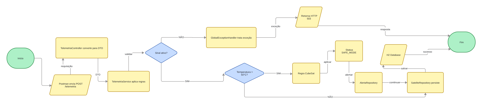
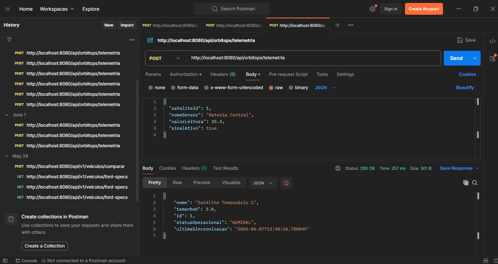

# OrbitOps - Governança Operacional Aeroespacial
## Módulo Backend & Arquitetura Orientada a Serviços (Java / Spring Boot)

## Descrição do Projeto
O **OrbitOps** é uma plataforma corporativa de ITSM (Gerenciamento de Serviços de TI) e Governança Operacional desenhada para mitigar riscos logísticos, operacionais e financeiros na *New Space Economy*. Utilizando os princípios consolidados do ITIL/ITSM, o sistema atua como o centro de controle terrestre, interceptando dados brutos de telemetria de housekeeping vindos de constelações de nanossatélites (CubeSats) e automatizando a resposta a incidentes críticos antes que ocorram falhas catastróficas.

Este módulo, desenvolvido em **Java com Spring Boot**, implementa uma **Arquitetura Orientada a Serviços (SOA)** responsável por expor WebServices REST seguros, realizar o mapeamento objeto-relacional de ativos e persistir o histórico de estados operacionais e alertas em um Banco de Dados Relacional.

---

## Integrantes do Grupo
* **Mateus dos Santos da Silva** - RM 558436
* **Nickolas Moreno Cardoso** - RM 557132
* **André Giovane de Maria** - RM 556384

---

## Mitigação de Perdas na Economia Espacial
Na era da *New Space Economy*, o custo de fabricação e lançamento de CubeSats caiu drasticamente, porém o risco operacional aumentou exponencialmente. A perda de contato com um ativo espacial ou a degradação irreversível de seus componentes internos representa não apenas um prejuízo financeiro direto (perda do hardware e do lançamento), mas também perdas comerciais massivas devido à interrupção de contratos de fornecimento de dados (imagens climáticas, GPS, segurança e telecomunicações).

O **OrbitOps** mitiga essas perdas financeiras e operacionais através de três pilares de governança automatizada:
1. **Preservação de Hardware via Safe Mode:** Ao monitorar continuamente o Subsistema de Energia (EPS) e os nódulos térmicos das baterias de íons de lítio, o motor de regras do Spring Boot altera preventivamente o estado do ativo para `SAFE_MODE` se a temperatura ultrapassar 55°C ou se a bateria cair abaixo de 15%. Isso preserva as células físicas contra estufamentos ou explosões, estendendo a vida útil do satélite.
2. **Mitigação de Detritos Espaciais (Bricking):** Satélites que perdem totalmente a energia ou sofrem falhas térmicas críticas tornam-se "lixo espacial" incontrolável, gerando riscos de colisão em órbita baixa (LEO). A abertura imediata de incidentes de criticidade alta permite que a equipe de engenharia em terra execute manobras de contingência ou comandos de órbita reversa antes do colapso total do sistema.
3. **Garantia de Acordo de Nível de Serviço (SLA):** Ao centralizar o recebimento de dados e o tratamento de falhas de sinal (`SateliteDesconectadoException`) em um barramento integrado, o sistema garante que falhas de comunicação terrena acionem backups redundantes instantaneamente, mantendo a disponibilidade dos dados vendidos a clientes corporativos.

---

## Tecnologias e Requisitos Técnicos Implementados
* **WebServices & API REST:** Exposição do endpoint corporativo `/api/orbitops/telemetria` para recebimento de payloads estruturados em formato JSON.
* **Conexão com Banco de Dados:** Mapeamento Objeto-Relacional (ORM) implementado via **Spring Data JPA / Hibernate** com persistência física automatizada nas tabelas relacionais `T_ORBIT_SATELITE` e `T_ORBIT_ALERTA`.
* **Banco de Dados Relacional:** Utilização do banco de dados em memória **H2 Database** para armazenamento, consultas rápidas e rastreabilidade dos ativos espaciais.
* **Modelagem de Domínio & POO Avançada:** Aplicação rígida de herança (Single Table Strategy), encapsulamento, classes abstratas (`Satelite`) e polimorfismo dinâmico (`CubeSat`).
* **Tratamento de Exceções Críticas:** Centralização do controle de erros através de um `@ControllerAdvice` (`GlobalExceptionHandler`), interceptando falhas severas de link e devolvendo códigos HTTP de status apropriados (ex: `503 Service Unavailable`) sem interromper a execução do servidor.
* **Estruturas Auxiliares (VO/DTO):** Isolamento de segurança na rede através da classe `TelemetriaDTO`, impedindo a exposição direta das entidades de banco de dados na camada corporativa.

---

## Como Executar a Aplicação
1. Importe o projeto como um projeto Maven na sua IDE de preferência (IntelliJ, Eclipse ou Spring Tool Suite).
2. Certifique-se de estar utilizando o **Java 17** ou superior.
3. Execute o projeto rodando a classe principal `OrbitOpsApplication.java`.
4. O servidor iniciará automaticamente na porta padrão **8080** (`http://localhost:8080`).
5. Para acessar o console administrativo visual do Banco de Dados H2, abra o navegador e acesse `http://localhost:8080/h2-console` (JDBC URL: `jdbc:h2:mem:orbitopsdb`, User Name: `sa`, sem senha).

---

## Diagrama



---

## Evidências de Execução de Testes (Postman)

### Teste 1: Cenário Operacional Nominal (HTTP 200 OK)
*Explicação:* Envio de telemetria com parâmetros estáveis (bateria fria e sinal ativo). O banco de dados registra o satélite com o status operacional como `"NOMINAL"`.



```text
Teste 2: Ativação de Modo de Segurança / Safe Mode (HTTP 200 OK) 
Explicação: Envio de telemetria simulando anomalia térmica (temperatura > 55°C). O polimorfismo dinâmico entra em ação, altera o status do satélite para "SAFE_MODE" e insere automaticamente um registro de auditoria na tabela de alertas.
```

```text
Teste 3: Tratamento de Falha Crítica de Comunicação (HTTP 503 Service Unavailable)
Explicação: Envio de pacote com o campo sinalAtivo: false. O sistema dispara a exceção customizada SateliteDesconectadoException e o GlobalExceptionHandler captura o erro, montando um JSON de resposta limpo com as informações do incidente de rede para a equipe terrestre, retornando o código HTTP 503.
```

